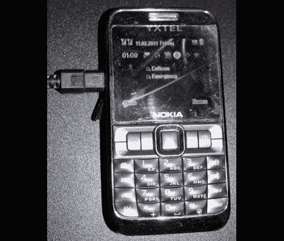

# 短信网关让你通过短信发推特

> 原文：<https://hackaday.com/2011/03/30/sms-gateway-lets-you-twitter-by-text-message/>

[GuySoft] [组装了一个基于手机的短信网关](https://guysoft.wordpress.com/2011/03/27/smsgate/)，允许他向 Twitter 推送短信。一旦启动并运行，它可以被多人使用，无论是共享的还是个人的 Twitter 账户。其核心是，这种设置将手机用作 Linux 机器上的一个有线调制解调器。开源软件包 Gammu SMSD 为运行在调制解调器模式下的手机提供了硬件挂钩。这个包已经在 Ubuntu 仓库中，但是它可以跨平台运行，并且可以从项目网站下载[。这使得[GuySoft]能够编写一个框架来检查收到的短信，比较收到的电话号码与保存的列表中的匹配，然后通过他们的 API 将消息从一个确认的号码推送到 Twitter。](http://wammu.eu/smsd/)

一个网络界面用于注册新号码，并将它们与 Twitter 账户相关联。在后端，[GuySoft]自己的 Python 脚本处理消息的翻译。您可以下载所有代码，并从 GitHub 库的[中的自述文件中获得更多关于设置的信息。](https://github.com/guysoft/SMS-Twitter-Gate)