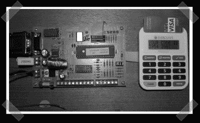

# 短信 PIN 哨兵阅读器

> 原文：<https://hackaday.com/2007/11/03/sms-pin-sentry-reader/>

【G 先生】在伦敦派来的[手下的 pin 哨兵被黑](http://www.mrg9999.com/pub/psm/)。他不喜欢这个设备看起来像一个旧的计算器，所以他组装了一个短信板，按需向他发送他的个人识别码。他将显示驱动程序的输出复用到 SMS 板上。当他通过手机进行身份验证时，该板会发送一条带有最新代码的消息。

*   [永久链接](http://www.mrg9999.com/pub/psm/)