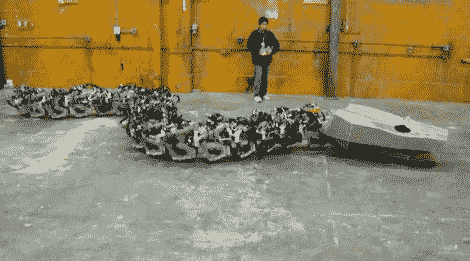

# 蛇形机器人给了我们机械的恐惧

> 原文：<https://hackaday.com/2011/11/15/snake-bot-gives-us-the-mechanical-heevy-jeevies/>

蛇怪？不，只是你的普通[巨型蛇形机器人建造](http://titanoboa.ca/)。该建筑旨在重现泰坦巨蛇，一种测量长度超过 50 英尺，重量超过 1 吨的史前蛇。他们正在完成目标的路上，正如你在上面看到的是完全可操作的，只缺少装饰性的细节，这只会让野兽不那么可怕。

之后的视频显示这条蛇在一片空地上游荡，大概是在温哥华 eatArt 总部。你可能还记得他们另一个版本中的团队，也出现在这个片段中，这个团队就是[蒙多蜘蛛](http://hackaday.com/2010/03/15/mondo-spider/)。最终，蛇会像蜘蛛一样有一个骑手，坐在头部后面的马鞍上。关于硬件的细节很少，但我们知道它是液压的，他们筹集了 1 万美元使建造成为可能。

出于某种原因，看到这些机器人互动让我们回想起童年的卡通。有没有可能 eatArt 剧组看了太多老的《特种部队》卡通片之类的？

[https://www.youtube.com/embed/Ocyhbij9JYQ?version=3&rel=1&showsearch=0&showinfo=1&iv_load_policy=1&fs=1&hl=en-US&autohide=2&wmode=transparent](https://www.youtube.com/embed/Ocyhbij9JYQ?version=3&rel=1&showsearch=0&showinfo=1&iv_load_policy=1&fs=1&hl=en-US&autohide=2&wmode=transparent)