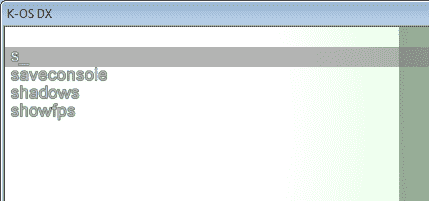
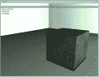
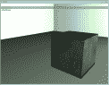

# 所以你想做一个命令行界面

> 原文：<https://hackaday.com/2010/08/26/so-you-want-to-make-a-command-line-interface/>



【巴克】不仅询问了[Answeres.HackaDay.com](http://answers.hackaday.com/can-you-make-a-basic-guide-to-designing-a-good-command-line-user-interface)，还给我们发来了如下邮件。

"你能为设计一个好的命令行用户界面做一个基本的指导吗？"

难道你不知道运气，我目前正在为我的一个项目做命令行类型的界面。虽然在跳转之后，我将遍历我的解释，应该注意的是，Answers.HackaDay.com 的其他答复也是很好的建议。

我们不知道[巴克]打算如何为 ATmega16 实现一个系统(串行显示？输出到液晶显示器？等等？)，但是对于我的项目来说，它如下。使用 C#和 DirectX(你能看出我在用开发人员控制台做游戏吗？)我将显示一个输入行、输入建议(intellisense)以及仅当给出正确输入时的输出。

首先，为了只关注 CLI，我假设您的项目具有所有必要的启动和加载功能。在我的例子中，[装载一个 DX 设备](http://www.codersource.net/asp-net/directx/directx-programming-in-c.aspx)，和[输入处理](http://www.codeproject.com/KB/system/rawinput.aspx)。此外，我们假设你知道如何用你各自的语言编程。

我将使用一种非常先进的技术(StringBuilder)来处理字符串，因为传统的字符串+字符串连接在内存上非常糟糕(游戏需要尽可能多的内存)。如果你不在乎内存，你可以简单地使用常规字符串。

首先，我们需要一些全局变量，

```
public bool bool_isConsoleOpen = false; //console, also known as CLI
public StringBuilder StringBuilder_Console = new StringBuilder(); //could be replaced with string
public InputDevice ID = new InputDevice();
```

在主函数循环中，调用名为 UpdateConsole()的方法；

现在，在我的设置中，为了防止不必要的用户输入，有一个小检查来查看控制台是“打开”还是“关闭”。

```

public void UpdateConsole()
{
 //opening console
 if (ID.isKeyDown(Keys.Oemtilde) &amp;&amp; ID.isOldKeyUp(Keys.Oemtilde))
  if (bool_isConsoleOpen == false)
  {
   bool_isConsoleOpen = true; //user pressed magic key, open console
   StringBuilder_Console = new StringBuilder(); //clear string
  }
  else
   bool_isConsoleOpen = false; //user pressed magic key, close console
}

```

下一段代码处理所有的输入(键盘输入)并构建将要输入的字符串。它包括支持大写，从剪贴板粘贴，还检查，以确保每个键输入是允许的。只需在 bool_isConsoleOpen = false 之后立即添加这一部分；。

```

//appending console if its open.
if (bool_isConsoleOpen == true)
{
 bool caps = false; //variable that helps determine if shift is pressed
 if (ID.isKeyDown(Keys.ShiftKey))
  caps = true;

 List pressedkeystemp = ID.PressedKeys; //I had to modify my ID a bit to make it get a list/array of the keys pressed.
 //go through each new key in list
 foreach (Keys currentkey in pressedkeystemp)
  {
   //make a string, this is for numbers
   string key;

   //if the key SPACE is pressed, make a space
   if (currentkey == Keys.Space)
   {
    StringBuilder_Console.Append(&quot; &quot;);
   }
   //if the key BACK is pressed, backspace
   else if (currentkey == Keys.Back)
   {
    if (StringBuilder_Console.Length &gt; 0)
     StringBuilder_Console.Remove(StringBuilder_Console.Length - 1, 1);
   }
   //if enter is pressed
   else if (currentkey == Keys.Enter)
   {
    //send it off to apply our data
    ApplicationSettings(StringBuilder_Console.ToString());
    //clear our string
    StringBuilder_Console = new StringBuilder();
   }
   //if a number is pressed, make it show up
   else if (StringKeyINTCheck(currentkey, out key))
   {
    StringBuilder_Console.Append(key);
   }
   //if a-z is pressed, make it show up
   else if (StringKeyCheck(currentkey))
   {
    // if V was just pressed and either control key is down
    if (currentkey == Keys.V &amp;&amp; (ID.isKeyDown(Keys.ControlKey)))
    {
     // paste time!
     string pastevalue = &quot;&quot;;
     pastevalue = System.Windows.Forms.Clipboard.GetText(System.Windows.Forms.TextDataFormat.Text);
     StringBuilder_Console.Append(pastevalue);
    }
    // if not pasting, do a regular key
    else if (!caps)
     StringBuilder_Console.Append(currentkey.ToString().ToLower());
    else if (caps)
     StringBuilder_Console.Append(currentkey.ToString());
  }
}

```

为了防止一些字符被打印出来，比如 alt 字符，并确保输入键可以被显示(否则你可能会出错)，我实现了一些检查。你会注意到我有两种不同的类型，Check(输入，输出)和 Check(输入)。前者是必要的，因为输入通常是 ASCII 值，需要在添加到构建器之前转换为字符或字符串。如果密钥有效，后者只返回 true 或 false。

第一个数字的例子

```

//numerals
private bool StringKeyINTCheck(Keys key, out string i)
{
 if (key == Keys.D1 || key == Keys.NumPad1)
 {
  i = &quot;1&quot;;
  return true;
 }
 else if (key == Keys.D2 || key == Keys.NumPad2)
 {
  i = &quot;2&quot;;
  return true;
 }
etc...
}

```

而后者，a-z

```

private bool StringKeyCheck(Keys key)
{
 if (key == Keys.A ||
                key == Keys.B ||
                key == Keys.C ||
                etc...
                key == Keys.X ||
                key == Keys.Y ||
                key == Keys.Z)
  return true;
 else
  return false;
}

```

现在我们已经构建了字符串，您会注意到，每当按下 enter 键时，就会调用新方法 ApplicationSettings(string)。这是发送用户刚刚输入的字符串/我们构建的字符串，我们现在必须分解该字符串，并确定用户输入了什么，以及应该发生什么。

再一次，我从一些检查开始，只是为了防止崩溃。

```

private void ApplicationSettings(string temp)
{
 if (temp != null) //make sure the user didn't type in &quot;&quot;.
 {
  //make it all lower case
  temp = temp.ToLower();

  //split by spaces
  string[] words = temp.Split(' ');
 }
}

```

现在有趣的部分来了，我们假设用户已经输入了诸如“退出”、“全屏 1”和“pos 100x100x100”之类的东西。第一个将退出应用程序，第二个将决定应用程序是否应该全屏。并且最终设置用户在空间中的 XYZ 位置。这三个只是多变量输入的简单例子，你当然可以根据需要编写任何程序。

紧跟在 string[] words = temp 之后。拆分(“”)；添加以下内容，

```

try
{
 //quit exit
 if (words[0] == &quot;quit&quot; || words[0] == &quot;exit&quot;)
  this.Close();

 //check for users fullscreen preference
 else if (words[0] == &quot;fullscreen&quot;)
 {
  if (words[1] == &quot;0&quot;)
   WindowedMode = true; //arbitrary global named windowedMode
  else if (words[1] == &quot;1&quot;)
   WindowedMode = false;
 }

 //set the camera position
 else if (words[0] == &quot;pos&quot;)
 {
  if (words[1].Contains(&quot;x&quot;))
  {
   string[] res = words[1].Split('x');
   int int_x = Convert.ToInt32(res[0]);
   int int_y = Convert.ToInt32(res[1]);
   int int_z = Convert.ToInt32(res[2]);

   Cam.Position = new Vector3(int_x, int_y, int_z);//arbitrary class camera Cam
  }
 }

}
catch (IndexOutOfRangeException e)
{
 //this occurs when the user types &quot;fullscreen $&quot;. Where $ is a variable, and the user typed nothing.
 //do nothing we should tell the user this with an error message.
}
catch (FormatException e)
{
 //this occurs when the user types &quot;resolution $x$&quot;, where $ is an int variable, and the user typed alpha.
 //do nothing we should tell the user this with an error message.
}

```

如果需要，你可以停在这里，你有输入和输出。然而，在我的控制台的当前版本中，我有大约 40 个不同的命令，我不能全部记住它们。所以我做了自己的智能感知。

这将需要建立另一个全局字符串列表，用命令填充它，然后按字母顺序排列。

```

List&lt;string&gt; ListString_Console = new List&lt;string&gt;();

private void LoadConsoleWordList()
{
 ListString_Console.Clear();

 //load in our console!
 ListString_Console.Add(&quot;fullscreen&quot;);
 ListString_Console.Add(&quot;resolution&quot;);
 ListString_Console.Add(&quot;showfps&quot;);
 //ListString_Console.Add(&quot;vertsync&quot;);
 ListString_Console.Add(&quot;maxfps&quot;);
 ListString_Console.Add(&quot;quit&quot;);
 ListString_Console.Add(&quot;exit&quot;);
 ListString_Console.Add(&quot;saveconsole&quot;);
 //ListString_Console.Add(&quot;bind&quot;);
 etc...

 //sort our list
 ListString_Console.Sort();
}

```

现在在我们的 UpdateConsole()的底部。

```

if (bool_isConsoleOpen == true)
{
 BMF_Arial.AddString(StringBuilder_Console.ToString() + &quot;_&quot;, &quot;console&quot;, new System.Drawing.RectangleF(5, 18, Resolution.Width, 20)); //how I draw things to the screen in DX. StringBuilder_Console is the string we built earlier, so the user can see what he is typing.

 //help our user search.
 int q = 35;

 //check every single string we know against what the user is typing in
 foreach (string stringy in ListString_Console)
 {
  //so long as the length is right, we continue
  if (stringy.Length &gt;= StringBuilder_Console.Length) //this part could be eliminated, and we could simply go through every letter. But this speeds up operations a smidge.
  {
   //temporary bool
   bool hodling = false;

   //go through every letter
   for (int i = 0; i &lt; StringBuilder_Console.Length; i++)
    if (stringy[i] == StringBuilder_Console[i])
     hodling = true;
    else
    {
     hodling = false;
     break;
    }

   //if it's a 100% match
   if (hodling)
   {
    //draw it, and update q relative.
    BMF_Arial.AddString(stringy, &quot;console&quot;, new RectangleF(5, 2 + q, Resolution.Width, 20)); //these are all the matches to the currently types string.
    q += 18;
   }
  }
 }
}

```

最后看起来怎么样？

没有控制台打开，

[](http://hackaday.com/wp-content/uploads/2010/08/untitled1.png)

点击魔法键打开控制台，开始输入，查看智能感知，

[](http://hackaday.com/wp-content/uploads/2010/08/untitled2.png)

继续输入，其他不匹配的单词将从显示中移除，

[](http://hackaday.com/wp-content/uploads/2010/08/untitled3.png)

按 enter 键执行命令，

[](http://hackaday.com/wp-content/uploads/2010/08/untitled4.png)