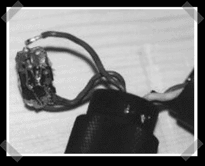

# 软启动手电筒，延长灯泡寿命

> 原文：<https://hackaday.com/2008/06/05/soft-start-your-flashlight-for-longer-bulb-life/>

【赖因哈德】有[大量的 DIY 水肺项目](http://insel.heim.at/malediven/350052/english.htm)。他组装的一个有趣的黑客技术是一个[软启动电路](http://insel.heim.at/malediven/350052/elektr_e.htm#Einfache%20Einschaltverz%F6gerung)，用来提高手电筒灯泡的寿命。尽管 led 越来越便宜，但 MR16 卤素非常便宜，会产生一些严重的流明。

*   [永久链接](http://insel.heim.at/malediven/350052/elektr_e.htm#Einfache%20Einschaltverz%F6gerung)