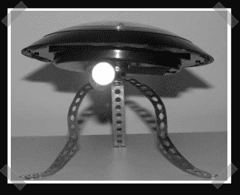

# 太阳能灯到 LED 投影仪

> 原文：<https://hackaday.com/2008/05/01/solar-lamp-to-led-projector/>

尽管它看起来像一个外星机器人，可能会从零开始重建你的房子，[这个](http://www.instructables.com/id/Solar-Powered-Light-Graffiti-Projector/?ALLSTEPS)实际上是我见过的第一个太阳能庭院灯。通过添加一个更亮的 LED，几个灯管，一个激光打印的透明胶片和一个镜头，你最终可以得到一个相对便宜的图像投影仪，可以从奇怪的位置投影定制的图形。[ [via](http://www.hacknmod.com/displayMOD.php?hack=1349)

*   [永久链接](http://www.instructables.com/id/Solar-Powered-Light-Graffiti-Projector/?ALLSTEPS)