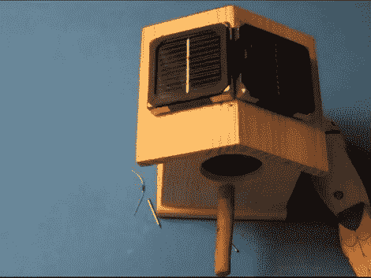

# 使用 B-Squares 的太阳能鸟巢推特

> 原文：<https://hackaday.com/2011/05/30/solar-powered-bird-house-tweets-using-b-squares/>

这个鸟屋会发出鸣叫让你知道居住者什么时候经过门…呃…洞。它使用太阳能电池板来保持电池充满，并使用 Arduino 和光学传感器来监控门口，通过 XBee 模块传递警报。

诚然，休息后的视频有点开玩笑，没有保护元素，甚至没有保护鸟粪。而且基本上是 B-Squares 的广告。但是我们还是喜欢。

这些正方形使用磁性角将太阳能正方形连接在一起，还有容纳 Arduino 和电池的正方形。这些磁角也作为电源和接地轨。两个钉子穿过鸟巢的屋顶，作为磁性附着太阳能电池板的表面，以及穿过木头的导线。难怪 [B-Squares 正在接近筹集其 Kickstarter 目标](http://www.kickstarter.com/projects/jmcrae/b-squares-modular-solar-powered-electrics)五倍的资金。

[https://www.youtube.com/embed/aQmtyG3buzc?version=3&rel=1&showsearch=0&showinfo=1&iv_load_policy=1&fs=1&hl=en-US&autohide=2&wmode=transparent](https://www.youtube.com/embed/aQmtyG3buzc?version=3&rel=1&showsearch=0&showinfo=1&iv_load_policy=1&fs=1&hl=en-US&autohide=2&wmode=transparent)