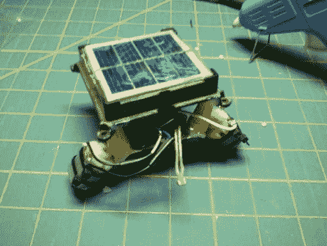

# 太阳能垃圾机器人

> 原文：<https://hackaday.com/2011/02/20/solar-powered-junkbot/>

Instructables 用户【martzsam】最近[用他在房子周围找到的各种垃圾](http://www.instructables.com/id/Solar-Powered-Robot-from-TRASH)制作了一个简单的机器人。他搜罗的第一批零件是一对 1.5v 的电动机和一些废电线，之后，他开始修理一个旧的花园灯。他详细介绍了如何小心地移除灯的太阳能电池板以及充电电路，他用充电电路为他的机器人供电。经过一点重新布线后，这些部件被安装在一些旧的安装器部件上，然后机器人开始运动。[martzsam]还提到，他调整了太阳能电池板的充电电路和电池，以半速运行电机，直到光照射到电池板上，此时机器人全速运行。

这个项目非常适合孩子们，因为它教授了重新利用普通家庭用品的概念，并允许他们发挥想象力设计一个有趣而简单的机器人。收集一些旧垃圾和你的孩子/侄子/侄女，然后出发吧！

继续阅读，观看机器人动作的快速视频。

[https://www.youtube.com/embed/z4K1reqKqI8?version=3&rel=1&showsearch=0&showinfo=1&iv_load_policy=1&fs=1&hl=en-US&autohide=2&wmode=transparent](https://www.youtube.com/embed/z4K1reqKqI8?version=3&rel=1&showsearch=0&showinfo=1&iv_load_policy=1&fs=1&hl=en-US&autohide=2&wmode=transparent)