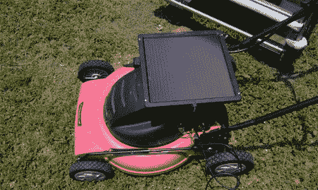

# 太阳能割草机

> 原文：<https://hackaday.com/2008/05/29/solar-powered-lawnmower/>

我们关于如何在[将你的家转换成太阳能](http://www.hackaday.com/2008/05/29/what-it-takes-to-go-solar/)的帖子可能会让你有一种绿色的心情，但是如果你想从更小的事情开始，看看这个关于[如何给你的割草机](http://www.instructables.com/id/solar-lawn-mower/)添加太阳能电池板的指南。

为此，你需要一个电池供电的割草机，以及一个带汽车打火机插孔的 12 伏太阳能充电器。这种简单的方法主要包括少量的布线工作；汽车点烟器插孔必须从太阳能电池板上移除，以便电线可以连接到电池上。对，就是这样。我们希望看到一个更优雅的解决方案，因为现在的方式是，每次你想割草时，你都必须将线路从并联切换到串联。

对于一个更完整的割草机黑客，看看这个[遥控割草机](http://www.hackaday.com/2007/02/11/remote-control-lawn-mower/)。

*   [永久链接](http://www.instructables.com/id/solar-lawn-mower/)