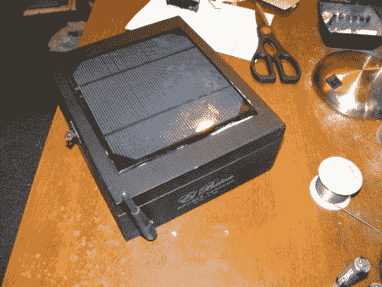

# 太阳能 WiFi 中继器

> 原文：<https://hackaday.com/2010/10/06/solar-powered-wifi-repeater/>

在所有这些时候，你需要在没有出口的地方广播你自己的接入点【拉里】向我们展示如何[制作太阳能热点](http://www.voltsxamps.com/?p=532)。他首先将一块太阳能电池板放在雪茄盒盖上，并将其连接到里面的五节可充电 AA 电池上。这些电源主板从路由器，这是一个完美的大小，以摩擦适合在开放。它已经刷新了 DD-WRT 的副本，并设置为扫描开放的 WiFi 连接。当它找到一个时，它会连接并向周围地区转播自己的 WiFi 信号。他把它放在他汽车的后窗里，用它在午餐时间上网。