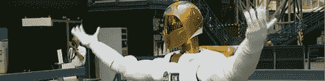
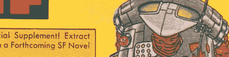

# 一些周末机器人善良的链接形式

> 原文：<https://hackaday.com/2010/11/06/some-weekend-robot-goodness/>

PBS 新闻时间[做了一篇关于机器人](http://www.pbs.org/newshour/bb/science/july-dec10/robots_10-29.html)的文章。他们谈论了美国宇航局的机器人，阿西莫，大狗，PR2，机器人罗比和其他一些人。我们没有看到任何新的东西，但我们真的很喜欢那里的报道。我们也从来不需要借口看那个家伙踢大狗一阵子。我们知道扭转局面只是时间问题。

PR2 背后的人 Willow Garage 正在进行一项调查，看看你最喜欢的机器人是什么。他们的名单很短，但是他们给你留了一个位置来添加名字。上面的图片，虽然不是从柳树车库。这是我从 [BotJunkie](http://www.botjunkie.com/2010/11/03/survey-whats-your-favorite-fictional-robot/) (我们爱这个网站)那里得到的照片，在那里我发现了这个故事。他们没有提到艺术家，但我觉得他们需要表扬，这是一件很棒的衬衫。

原来是在 [chopshopstore](http://www.chopshopstore.com/product.php?productid=16186) 有售的 t 恤设计。你可以看到他们的眼睛是用夜光材料做的。另一方面， [hackaday 商店](http://calebkraft.com/hackaday)昨天刚刚在黑暗材料中发光(以及重新设计),并将在不久的将来宣布几个新设计。

我个人继承了几个装满科幻纸浆的巨大箱子。我在这些电影中看到的机器人令人惊叹，从令人惊讶的荒谬到令人惊讶的令人敬畏。我刚刚开始浏览封面，并计划每天至少发一篇。你知道什么会很棒吗？如果我有[这些](http://hackaday.com/2009/04/20/high-speed-book-scanner-from-trash/)中的一个。