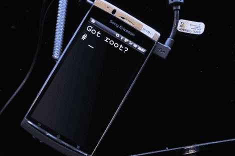

# 索尼爱立信推广 Android Bootloader 解锁

> 原文：<https://hackaday.com/2011/04/14/sony-ericsson-android-bootloader-unlockin/>

索尼爱立信最近在他们的开发者世界门户网站上增加了一个名为[解锁引导加载程序](http://unlockbootloader.sonyericsson.com/)的新栏目。他们提供了一些更新的 Android 手机所需的所有信息和工具。

当然，这些信息来自索尼爱立信，充斥着警告、免责声明和保修作废的言辞。一旦你涉水通过所有这些，你将不得不输入你的手机的 IMEI 号码，你的名字和电子邮件地址，以获得你的手机的独特的引导加载解锁密钥。这里希望他们不要使用表格信息立即作废保修。

解锁并非没有后果，但从用户界面的调整和性能的改善到定制应用程序和网络共享，解锁你的 Android 设备的理由可能比不去管它的理由更多。在一个人们对公司为潜在的越狱者增加绊脚石大惊小怪的时代，很高兴看到至少有一家公司正在尽其所能帮助黑客冒险。有人想弄清楚为什么索尼爱立信喜欢支持黑客，但是索尼起诉人们在 ps3 上做类似的事情吗？

感谢[flip] |混音图片致谢(cc by-sa 2.0):[[taka @ p . p . r . s](http://www.flickr.com/photos/takapprs_flickr/5487305632/)