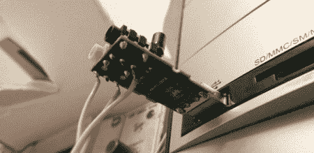

# 声卡微控制器/PC 通信

> 原文：<https://hackaday.com/2011/07/10/sound-card-microcontrollerpc-communication/>

从微控制器发送数据的通常方式是通过 RS-232 与 MAX232 串行 IC、晶体和一台相对古老的计算机，或者通过位碰撞 USB 协议并担心驱动程序问题。不满足于这些解决方案，[Scott]提出了不需要任何额外组件的[声卡μC/PC 通信](http://www.swharden.com/blog/2011-07-09-sound-card-microcontrollerpc-communication/)。

[Scott]在易贝买了一个便宜的 USB 声卡加密狗(虽然内置声卡也可以)，并将插头的尖端和环连接到微控制器。微控制器发送的数据很像莫尔斯电码——脉冲之间的短间隔是 0，长间隔是 1。这是由 Python 脚本使用 PyAudio 解析的。同步、定时和校准是自动进行的，因为有本视频中解释的 10 位‘数据包报头’[。](http://www.youtube.com/watch?v=WKp0P43uhzY)

在他有了从微控制器向个人电脑发送数据的非常好的方法后，[Scott]问自己是否有可能进行双向通信。使用相同的声卡设置，他设法从 ATtiny44a 上获得双向通信。你可以在这里看到他这个[的演示视频。](http://www.youtube.com/watch?v=fhsYGRdwIaw)

hack 的聪明是压倒性的，我们有点惊讶这种技术不在 solder monkeys 的标准剧目中。看完这个之后，我们很想扔掉六个 USB/RS-232 适配器。反正他们从来没有工作过。看看下面[Scott]关于他身材的高信息量视频。

[https://www.youtube.com/embed/I0UEooQH2bw?version=3&rel=1&showsearch=0&showinfo=1&iv_load_policy=1&fs=1&hl=en-US&autohide=2&wmode=transparent](https://www.youtube.com/embed/I0UEooQH2bw?version=3&rel=1&showsearch=0&showinfo=1&iv_load_policy=1&fs=1&hl=en-US&autohide=2&wmode=transparent)