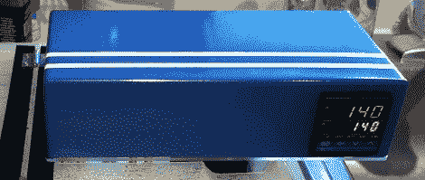

# 带有赛车条纹的背心

> 原文：<https://hackaday.com/2011/11/13/sous-vide-with-racing-stripes/>

我们不会质疑将[赛车条纹放在慢炖锅](http://battlesnake.blogspot.com/2011/10/my-first-foray-into-modern-cooking.html)上的逻辑，但【Evan】的 sous vide 机器是我们见过的最专业的机器。

在[埃文]找到一本讲述烹饪的物理和化学的烹饪书后，他想做一些真正的美食。Sous vide 向他倾诉了自己的想法,[Evan]承诺要建造一个浸没式炊具。

在网上逛了一圈后，[埃文]在 Make 上发现了一颗小宝石。制造成本很低——它是围绕现成的 PID 控制器和热电偶构建的。[Evan]虽然他想建立自己的 PID 控制器，但时间就是金钱，他无法击败商业版本的功能。

围栏是[埃文]建造过程中最耗时的部分。这是一块 1/8 英寸的铝板，被切割并弯曲成合适的尺寸。锋利的边缘被锉平并用环氧树脂连接起来；这绝对不是建造围墙的“正常”方式。配色方案借用了这辆雷诺的风格——法式烹饪的灵感来自一辆法国汽车。

至于[埃文]的结果，他做了一份用大蒜、百里香、橄榄油、盐和胡椒腌制的 5 盎司里脊。这道菜配有烤育空黄金土豆和嫩煎西兰花。光是看着这张照片，我们就会流口水，所以我们打赌[埃文]做了*出色的*工作。