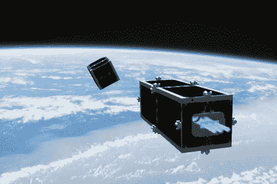

# 空间；在瑞士人得逞之前，这里是个垃圾场

> 原文：<https://hackaday.com/2012/02/15/space-its-a-junkyard-until-the-swiss-get-their-way/>

瑞士人计划清理近地空间环境。他们刚刚宣布了一种碎片清除装置，计划在三到五年内推出。这个计划的第一个目标是捞起两颗卫星。它们都是瑞士所有的，但是当我们听到这个名字的时候，我们脑海中会闪现出[和](http://www.imdb.com/title/tt0079574/)一样非常詹姆斯·邦德的东西。

我们确信你已经知道在轨道上有太空垃圾的问题。但是你知道美国宇航局追踪了 50 万块轨道碎片吗？清理听起来确实是件好事。计划是检测违规项目，匹配其轨迹，以某种方式抓住它(包括停止它正在做的任何旋转)，然后封装一切以供最终重返。看起来他们打算在最后阶段把整个机器人和垃圾一起烧掉。

我们不断听到机器人清理我们制造的垃圾的方法。希望我们能在某个时候看到这些技术的应用。

[via [Reddit](http://www.reddit.com/r/science/comments/pqtqa/like_a_roomba_for_outer_space_swiss_scientists/)