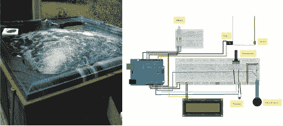

# 斯帕杜伊诺加热一个用过的热水浴缸

> 原文：<https://hackaday.com/2011/11/14/spaduino-heats-up-a-used-hot-tub/>

[Ryan]室友们认为热水浴缸正是他们所需要的来给这个地方增添情趣。他们查看了克雷格的清单，找到了一个价格合适的。经过收购和设置，他们很高兴地发现，射流和泵工作得很好。但是你不会想把你的大脚趾伸进这个冰冷的低温实验中。控制系统中的一些漏洞暴露了负责开关加热器的死继电器。[瑞安]开始建造一个控制系统，取代已有 20 年历史的原版，而不是更换零件。

加热元件仍然工作，但它的额定功率为 5.5 千瓦，没有办法自动开关。[Ryan]找到了一个 60 安培的固态继电器，可以处理负载，并与他的 Arduino 配合良好。最初的测试让浴缸重新运转起来。显然，你希望浴缸保持温度，所以增加了一个热敏电阻来读取加热器芯的读数。还有一个调节温度的电位器和一个显示当前设置的液晶显示屏。但是[Ryan]希望随着时间的推移增加更多的功能，比如加入喷气控制，以及通过 Xbee 模块增加无线通信。