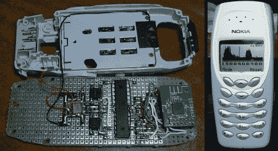

# 嵌入手机的频谱分析仪

> 原文：<https://hackaday.com/2010/02/12/spectrum-analyzer-wedged-into-a-cellphone/>

[Miguel A. Vallejo]想要一款适用于 2.4GHz ISM 频段的便携式频谱分析仪。没问题，有一些模块很容易与微控制器和 LCD 屏幕连接。但是随身携带一个黑色的项目箱并不能让人觉得“酷”,所以他把他的频谱分析仪装进了手机里。这对他来说使许多事情变得更容易；他已经有了几部旧手机，他能够使用原装电池和原装液晶显示屏，而且很多安装工作已经为你完成了。唯一的挑战是将他的定制电路安装进去。通过砍掉 CYWM6935 模块的一部分，并切割一些与原始 PCB 形状相同的原板，他成功地将所有东西都放进了这个微型便携式封装中。现在，他正在寻找一种方法来整合充电器和开关。

如果你身边没有旧手机，你可以[尝试建造一个使用字符显示的频谱分析仪](http://hackaday.com/2009/12/27/atmega8-spectrum-analyzer/)。但是我们建议联系你的朋友要他们的旧手机。屏幕被用于[各种](http://hackaday.com/2009/09/28/capacitive-buttons-control-all-life/) [趣味](http://hackaday.com/2009/02/10/accelerometer-controlled-pong-2/) [项目](http://hackaday.com/2008/06/16/nokia-color-lcd-flickr-frame/)。