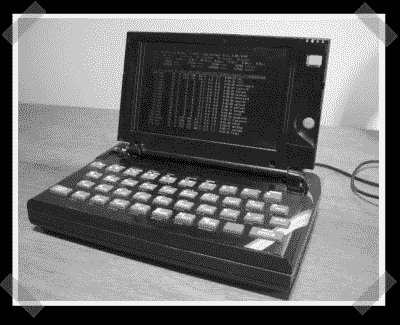

# 光谱 ZX 笔记本电脑

> 原文：<https://hackaday.com/2008/03/19/spectrum-zx-laptop/>

【吉姆】送来了[这个](http://srimech.com/?page_id=18)有趣的[笔记本电脑](http://www.mahalo.com/Laptop_Hacks "Laptop Hacks - Mahalo")改装项目。他从一台光谱 ZX 和一台东芝 Libretto 110 开始。歌词保留了它的大脑，但小写字母和键盘被 ZX 硬件取代。由于两台机器都使用矩阵风格的键盘(但不同的矩阵布局)，他能够创建一个无源适配器电路来匹配东西。

*   [永久链接](http://srimech.com/?page_id=18)