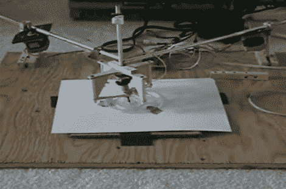

# 肺活量图发生器

> 原文：<https://hackaday.com/2010/07/23/spirograph-generator/>

Agnewgraph I 可以绘制出非常漂亮的肺活量图。它没有依赖一丝不苟的精密数控硬件，而是使用了一个类似于我们非常喜欢的名片的[的螺旋模板。[Mpark]设计的关键是一个连接到笔的模拟操纵杆。当笔沿着塑料导轨移动时，螺旋桨微控制器会根据操纵杆计算移动的角度。这些测量用于决定如何移动为框架提供水平和垂直运动的两个步进电机。我们在休息后附上了一个视频，以防我们的粗略描述没有为您做到这一点。](http://hackaday.com/2009/05/30/business-cards-at-maker-faire/)

[https://www.youtube.com/embed/U2KsvADOGDw?version=3&rel=1&showsearch=0&showinfo=1&iv_load_policy=1&fs=1&hl=en-US&autohide=2&wmode=transparent](https://www.youtube.com/embed/U2KsvADOGDw?version=3&rel=1&showsearch=0&showinfo=1&iv_load_policy=1&fs=1&hl=en-US&autohide=2&wmode=transparent)