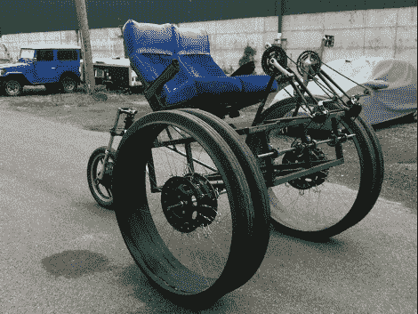

# 辐条？我们不需要发臭的辐条！

> 原文：<https://hackaday.com/2011/06/22/spokes-we-dont-need-no-stinking-spokes/>

北海巨妖航空是恶魔繁殖者的自行车。不管怎样，这让我们想起了什么。[加布里埃尔·凯恩]从《燃烧的人》中获得了灵感，也有几个理由来建造它，但我们最喜欢听到的是“因为我能”。

为两人制造的过度增长的三轮车不仅仅是一些焊接在一起的自行车框架。[加布里埃尔]用一些非常有趣的方法自己做了一套轮子。我们认为轮毂本身实际上是汽车轮辋钻孔接受吊环螺栓。由塑料涵管制成的钢丝网取代了刚性辐条，使轮圈保持居中。为了抓地力，山地车轮胎被切成碎片，并拧到管道部分。整个船是用一个船轮(上图中没有)来转动位于两个骑手后面的小轮子来驾驶的。

休息过后，我们嵌入了车辆行驶的视频。这是到目前为止发布的三个视频中的第二个，另外两个介绍了[Gabriel]如何解决他在建造过程中面临的设计挑战。

在周一看到[quad bike 的帖子后【Gabriel】给了我们一个链接。不要把你的项目藏在心里，一定要](http://hackaday.com/2011/06/21/quadbike-smaller-is-faster/)[给我们发送一个提示](http://hackaday.com/contact-hack-a-day/)，我们会确保继续发布关于它们的内容。

[https://www.youtube.com/embed/w_ixFLQOqXA?version=3&rel=1&showsearch=0&showinfo=1&iv_load_policy=1&fs=1&hl=en-US&autohide=2&wmode=transparent](https://www.youtube.com/embed/w_ixFLQOqXA?version=3&rel=1&showsearch=0&showinfo=1&iv_load_policy=1&fs=1&hl=en-US&autohide=2&wmode=transparent)