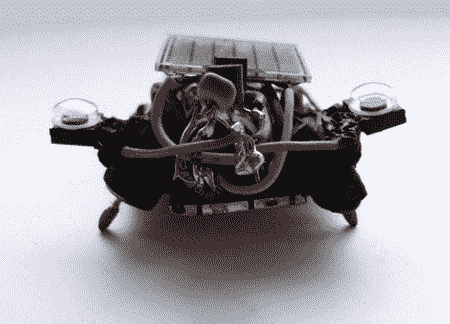

# 聚焦 Tinyminds

> 原文：<https://hackaday.com/2008/07/10/spotlight-on-tinyminds/>

[Etsy](http://www.etsy.com) 将[的聚光灯对准了被大肆宣传的太阳能机器人的创造者 tinyminds](http://www.etsy.com/storque/section/spotlight/article/fresh-shop-tinyminds/2179/) 。[Jenny]是 tiny minds 的幕后策划者，自称是“全方位的书呆子和不停的工匠”，她声称从纸张和木材等各种各样的东西中为她的[光束](http://en.wikipedia.org/wiki/BEAM_robotics)太阳能虫和怪物机器人汲取灵感。她将制造机器人和利用太阳能的过程描述为“神奇的”。事实上，它们是太阳能供电的，这是一个巨大的优势——这些“宠物”永远不会死，永远不需要充电，只需要光。她的[克苏鲁机器人通过 BoingBoing Gadgets](http://gadgets.boingboing.net/2008/07/09/lord-cthulhu-the-sol.html) 链接，不幸的是目前已经售罄。tinyminds 还有大量其他[发明型](http://www.etsy.com/view_listing.php?listing_id=12508980)、[同样](http://www.etsy.com/view_listing.php?listing_id=13248601)、[启发型](http://www.etsy.com/view_listing.php?listing_id=13248319)、[机器人](http://www.etsy.com/view_listing.php?listing_id=13073584)可供购买。

*   [永久链接](http://www.etsy.com/shop.php?user_id=5716783)