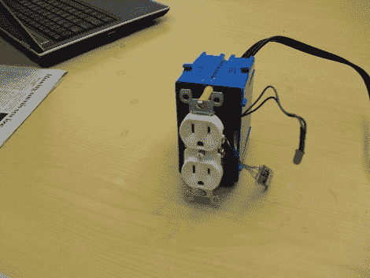

# 弹簧控制的交流电源插座

> 原文：<https://hackaday.com/2010/05/29/sprime-controlled-ac-outlets/>

读者[Tim Upthegrove]提交了一篇关于供电和监控交流电源插座和设备的小说，名为 [SPRIME](http://weenbox.dyndns.org/sprime/index.html) ，或简单的电力线远程交互监视器和执行器。相比以前的黑客，如 [120v 开关](http://hackaday.com/2010/01/31/120v-switching/)或[快速廉价遥控插座](http://hackaday.com/2009/01/19/quick-cheap-remote-outlets/)，那只是打开或关闭一个插座；SPRIME 不仅可以通过互联网控制插座，还可以控制当前接入设备的用电情况。

我们真的很喜欢他们的想法，让电力公司使用 SPRIME 插座来减少高峰时段的电力消耗，但遗憾的是，我们没有看到它在家庭中很快得到实施。抓一个裂缝后 SPRIME 的视频。

[感谢 Chris McClanahan 和 Jeff Starker 的项目，感谢 deyjavont 指出我们的愚蠢错误]

[https://www.youtube.com/embed/uFRgc2QtA54?version=3&rel=1&showsearch=0&showinfo=1&iv_load_policy=1&fs=1&hl=en-US&autohide=2&wmode=transparent](https://www.youtube.com/embed/uFRgc2QtA54?version=3&rel=1&showsearch=0&showinfo=1&iv_load_policy=1&fs=1&hl=en-US&autohide=2&wmode=transparent)