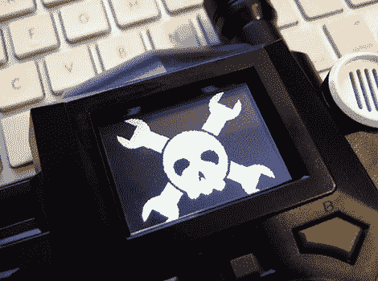
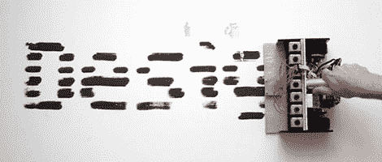
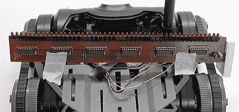
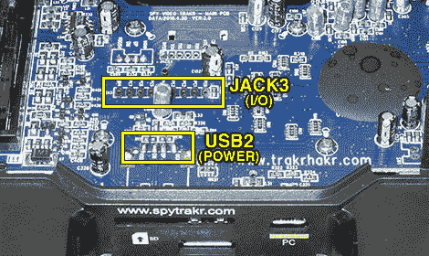
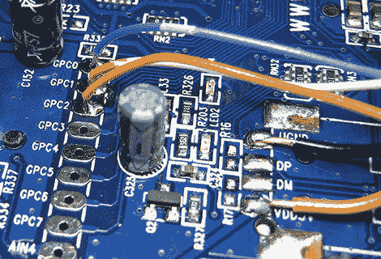

# 间谍视频追踪器:软件和首次黑客攻击

> 原文：<https://hackaday.com/2010/09/02/spy-video-trakr-software-and-first-hack/>



[我们最初对 Spy Video TRAKR“App BUILDR”网站的看法](http://hackaday.com/2010/08/27/spy-video-trakr-first-impressions/)让我们相信这将是一个基于互联网的代码编辑器和编译器，类似于 [mbed 微控制器](http://hackaday.com/2009/11/21/review-mbed-nxp-lpc1768-microcontroller/)开发工具。[深入研究可用资源，我们不完全确定这是一个准确的评估——毕竟 TRAKR 很可能允许甚至要求离线开发。不管最终的计划是什么，在此期间，我们已经发现了早期的文档、库和独立的 C 编译器，并将其提交给您娱乐，以制作我们的第一个 TRAKR hack！](http://hackaday.com/2010/08/30/spy-video-trakr-the-teardown/)

现在的 TRAKR 软件开发，用我们尽可能委婉的说法，有一种狂野西部的味道。预计完成的工具和参考资料要到 10 月份才会出来。早期的文档很粗糙——仍然缺少完整的部分——所以经常需要翻遍他们的示例代码来了解事情是如何操作的。编译器现在非常粗糙……它只需要一个小补丁就可以开始，并且只能在 T2 的 Cygwin T3 中工作，这是一个用于 Windows 系统的类似 UNIX 的命令外壳。所以今晚我们要像 1999 年一样编程！为了继续，我们必须假设您至少对命令行开发工具有所了解，因为从头开始解释整个过程超出了我们在这里的篇幅。

这可能是不言而喻的，但对于后代来说:这些是测试版工具，随着 TRAKR HAKR 站点的发布，整个过程几乎肯定会改变，使这些方向变得过时。在那之前，对于那些想早点开始的人，这里是我们如何开始构建我们自己的 TRAKR hacks…

## 获取编译器

C 编译器和文档目前位于 TRAKR 网站的 [Apps 帮助页面。只要按照那里的指示下载应用程序初级读本(包含编译器和演示源代码)、TRAKR code book PDF(TRAKR 编程介绍)以及函数参考和代码片段，以便在熟悉概念后进行轻量级参考。](http://www.spygear.net/help/apps.php)

应用程序帮助页面声明这些工具适用于 Linux，但这并不完全正确。App Primer ZIP 文件仅包含 Cygwin (Windows)工具链，以及 TRAKR 库和示例代码。C 编译器基于 ARM-elf-gcc 3 . 4 . 6——Linux 用户可能有机会从 GNU ARM 网站获得预构建的 3.4.3 包。你仍然需要为这些库下载应用入门。对于 Mac OS X，事情变得很糟糕…我们还没有找到一个可行的英特尔 Mac 软件包。从源代码(或通过 MacPorts)构建 3.4.6 工具链只会带来挫折，而且 TRAKR makefiles 不能很好地与后来的(但正在工作的)arm-elf-gcc 版本兼容。乔伊。渴望前进，不想在肯定会改变的测试工具上投入大量时间，我们中的一些人现在只是简单地使用 [VirtualBox](http://www.virtualbox.org/) 中的 Windows 包。

## 让编译器*实际工作*

解包 App Primer ZIP 文件后，将里面的 TRAKR.1 文件夹复制到 Cygwin 目录中合适的工作位置。_MACOSX 文件夹可以删除——这只是文件在某一点上通过 Mac 的产物；这里没有 OS X 构建工具。

打开初级读本并尝试编译示例，您会遇到一系列“未定义的引用”错误消息和一个失败的构建。TRAKR 库有一个问题——一些测试数据没有正确归档——但这是一个简单的修复方法。进入 Internals 目录，使用 vi 编辑 Makefile(或者选择另一个编辑器，如果您安装了的话)。第 22 行看起来像这样:

```
OBJECTS = $(S_OBJECTS) $(O_OBJECTS)
```

应该改成这样:

```
OBJECTS = $(S_OBJECTS) $(O_OBJECTS) $(O_IMAGES)
```

保存更改并退出编辑器，然后(仍在内部目录中)键入:

```
make trakr.a
```

现在，您可以返回到任何示例，并通过键入“make”成功编译。例如:

```
cd ../EX06_Sound
make
```

这将创造一个”。可以加载到 TRAKR 上的“bin”文件。在您的计算机和 TRAKR 车辆之间连接一根 USB 电缆(电源开关可以打开或关闭，这无关紧要)。过一会儿，TRAKR 的内部存储将显示为一个小的可移动驱动器。然后复制。将文件绑定到该驱动器上的 APPs 文件夹，例如:

```
cp EX\ Sound.bin E:APPs
```

断开 USB 电缆，启动 TRAKR 和遥控器，按下遥控器的 Home 按钮，使用任意一个控制杆导航至“EX Sound”菜单项，然后按下“Go”按钮。该应用程序应该会提示您从 TRAKR 的麦克风中录制 10 秒钟的音频，然后播放该音频。很酷的东西！

## 编写自己的应用程序

每个 TRAKR app 都要求有三个函数:Start()、Run()和 End()。您的 Start()函数包含一次性初始化代码，比如将电机打开到软件控制；End()是一个补充函数，用于在程序结束时，将控制恢复到正常的 TRAKR 操作。Run()包含了你的应用程序的核心…这个函数应该返回“真”或者“假”来指示它是否应该再次迭代运行，或者准备退出。

头文件 svt.h 包含代码簿和参考文档中描述的函数的常量和原型。这包括产生图形和声音、打开或关闭[红外 LED](http://hackaday.com/2009/08/17/adafruit-releases-new-tv-b-gone-kit/) 、读取控制、驱动电机和访问 SD 卡的高级功能。这是所有*官方记录的东西*，app builder 将鼓励我们使用。

但是还有第二个头文件 JAPI.h，它揭示了 TRAKR 库构建所基于的许多底层功能。就目前而言，这是访问真正有趣的东西的唯一方式，如数字 I/O、视频处理和 USB 主机。这绝对是*而不是*官方记录的东西，现在依赖它意味着你的代码可能需要一些修改才能在以后使用官方的东西。

两个库中都明显缺少一些东西:更高级别的数字 I/O，如串行 [UART](http://hackaday.com/2010/06/24/adding-a-serial-port-to-the-zipit/) 或精确的 [PWM](http://hackaday.com/2010/08/31/controlling-an-ac-drill-using-one-pwm-connection/) 控制。我们甚至还不确定是否有任何可访问的突破线对应于这些硬件功能。也许这是即将到来的事情，或者也许这将需要芯片数据手册，代码与寄存器直接对话。最坏的情况是，这样的 I/O 只能用更慢的[位碰撞](http://hackaday.com/2009/09/22/introduction-to-ftdi-bitbang-mode/)方法来完成。这正是我们所做的…

## 我们的第一次入侵

我们真的想展示 TRAKR 软件和硬件的可破解性。这里没有空间写一篇过于技术性的文章，但是我们也不想让你做一点小小的修改。希望我们已经在这里找到了一个很好的平衡…有点深奥，但是大多数先前有适度焊接和编程经验的读者应该能够跟随并创建一些类似的东西。

我们的灵感来自于【Hack a Day 早先的一篇关于 txtBomber 的文章，这是一款手持式点阵涂鸦打印机:



轨道的宽度大约和一张纸一样。有了[一排螺线管](http://hackaday.com/2010/02/17/robo-vibe/)和一些油漆标记，我们可以用它来制造一个奇妙的混乱…或者更简单，跳过标记，前往海滩，在沙滩上“梳理”信息。

问题是，我们手头没有一堆螺线管，我们想直接进入这一领域，而不是等待零件到达。在我们的[秘密地下金库](http://hackaday.com/2009/09/21/virtual-pool-real-world-interface/)的废墟中，我们找到了以前项目的一个很好的替代品:一排由[移位寄存器](http://hackaday.com/2010/08/19/7-segment-sudoku/)驱动的 48 个可寻址 led，它们安装在与 TRAKR 的 10 英寸宽度完全匹配的板上！所以我们现在的目标是在灯光下达到同样的效果。跟踪器移动得太慢，视网膜[视觉暂留](http://hackaday.com/2010/03/20/pov-clock-inside-acrylic-block/)无法发生，但我们可以使用[长曝光摄影](http://hackaday.com/2009/12/28/lightdrawing-robot/)来捕捉结果。



现在任何人都可以购买现成的 TRAKR，但灯条是为 POV 项目定制的。好消息是，这是一个非常常见的电路，我们在之前就已经联系过了，可以在试验板上构建一个稍微缩小的版本。我们的有一组六个带去耦电容的 75HC595 移位寄存器，每个寄存器驱动八个带限流电阻的 led。与那篇文章中显示的非常相似，但级联到六个芯片。你也可以用 ShiftBrite LEDs 灯做类似的事情(而且*方式*更多彩)[。](http://hackaday.com/2009/06/29/parts-shiftbrite-rgb-led-module-a6281/)

LED 板用胶带固定在机器人上。不惜重金！



正如我们在[拆解](http://hackaday.com/2010/08/30/spy-video-trakr-the-teardown/)中指出的，包含 GPIO 线的非常重要的 JACK3 正好位于 TRAKR 主板的中间。我们将用作电源分接头的未填充接头 USB2 更靠近外部边缘。



在我们匆忙创建一个像样的演示时，我们只是将电线直接焊接到 TRAKR 的电路板上，但在某些时候，我们打算再次拆除这个东西，并焊接一个合适的插头来插入电线。对于+5v 直流和接地，使用空闲 USB 连接器的 VDD5V 和 VGND 焊盘。移位寄存器需要三条数据线(我们稍后会解释)，我们选择使用电路板上的第一批 GPIO 线，标记为 GPC0、GPC1 和 GPC2。

移位寄存器接口被称为[三线](http://hackaday.com/2009/06/30/parts-spi-eeprom-25aa25lc/)串行连接，有时也称为 SPI(串行外设互连)，是一种*同步串行*接口，这意味着每一位数据都伴随着另一条线路上时钟位的同步滴答。第三条线称为*锁存器*，表示数据传输结束——在 8 位移位寄存器的情况下，它将在其 8 条并行数据线上输出通过串行连接“输入”的最后 8 位。

对于我们的 light bar hack，我们将使用 GPC0 作为时钟线，GPC1 作为数据线，GPC2 作为锁存器。大多数微控制器都具有某种本机三线/SPI 支持，但如前所述，对于目前的 TRAKR 库，我们必须通过软件控制来触发所有这些位。

接下来我们需要的是在 led 上显示图像，一次一行。很自然，我们将使用 Hack a Day 徽标:


在后面提供的源代码档案中，图像以 1 位 Windows BMP 文件的形式出现，因为数据是未压缩的，所以处理起来很简单。图像会向侧面倾斜，因为与处理垂直列相比，程序解码位图的每个水平行所需的代码更少。它的宽度为 48 像素，对应于 LED 栏中的 48 像素，高度为 60 像素，包括两端的一些空白行，这样重复的徽标就不会一个接一个。

我们的示例程序是为这个演示图像硬编码的，它嵌入在可执行文件中。更复杂的程序可能允许用户从 SD 卡加载图像，并正确解析 BMP 头以查询实际的图像尺寸。同样，我们只是希望保持代码简单，而不是延伸到数百行。

```

// POV demo for Spy Video TRAKR w/shift register LED bar.

#include &quot;svt.h&quot;  // Official API
#include &quot;JAPI.h&quot; // Secret sauce

#define ROWS  60 // Image height in pixels
#define COLS  6  // Image width in bytes (pixels = 8x this)
#define PAD   (3 - ((COLS - 1) &amp; 3))
extern unsigned char _binary_logo_bmp_start[]; // In logo.o

#define CLOCK (1 &lt;&lt; 0)  // GPC0
#define DATA  (1 &lt;&lt; 1)  // GPC1
#define LATCH (1 &lt;&lt; 2)  // GPC2

void Start()
{
  JAPI_SetIoOutputMode(CLOCK | DATA | LATCH);
}

bool Run()
{
  unsigned char *ptr, byte;
  int r, c, b;

  // 62 byte offset to start of image data within BMP:
  // 14 byte BMP header, 40 byte DIB header, 8 byte palette
  ptr = &amp;_binary_logo_bmp_start[62];

  for(r=0; r&lt;ROWS; r++) {     // Each line in image
    for(c=0; c&lt;COLS; c++) {   // Each byte in line
      byte = *ptr++;
      for(b=128; b; b&gt;&gt;=1) {  // Each bit in byte
        if(byte &amp; b) JAPI_SetIoLow(DATA);
        else         JAPI_SetIoHigh(DATA);
        JAPI_SetIoHigh(CLOCK);
        JAPI_SetIoLow(CLOCK);
      }
    }
    JAPI_SetIoHigh(LATCH);
    JAPI_SetIoLow(LATCH);
    Sleep(20);
    ptr += PAD;  // BMP rows start on 4-byte boundary
  }

  return true;
}

void End()
{
}

```

图形相关的#定义现在应该清楚了，我们知道这个程序是为这个特定的图像设置的。时钟、数据和 LATCH #定义对应于传递给 GPIO 相关功能的各个位，使后续代码更易于读取。

在 Start()函数中，对 JAPI_SetIoOutputMode()的调用将所有三行初始化为输出。

由于图像被格式化的方式，现在 Run()函数中要做的工作很少。对于图像的每一水平行，六个字节的图像数据一次输出一位，总共 48 位:数据线设置为高或低，以指示相应的 1 位像素值，然后时钟线快速切换为高，然后切换为低，以“输出”数据位。在每一行的末尾，锁存线被类似地切换，以告诉移位寄存器显示新数据。考虑到 TRAKR 的有限速度，20 毫秒的延迟会使图像保持一会儿，所以它不会全部被挤压在一起。

如果需要，下一行将使图像指针前进到下一行的开头。在 BMP 文件中，行的宽度总是 4 字节的倍数。我们的位图只有 48 像素(6 字节)宽，所以它跳过了每行末尾的两个额外字节。最后的“return true 行告诉 TRAKR 库无限期地重复我们的 Run()函数。

对于这个程序来说，End()函数是空的，但是它仍然需要存在以使链接器满意。

[包含上述源代码、位图图像和 makefile 的 ZIP 文件可在此下载](http://www.paintyourdragon.com/pov.zip)。将这个归档文件解压到 Trakr.1 文件夹中，在内部目录旁边(不在内部目录中)。“cd”到这个目录，并键入“make”。如果一切按计划进行，应该会生成文件 POV.bin，可以像前面描述的那样将它加载到 TRAKR 上。


将电路悬挂在 TRAKR 之外时，需要考虑的一点是靠近 2.4 GHz 天线。我们浪费了半个小时追踪一个“软件错误”，实际上是我们粗心的长电线接收到了无线电干扰(你仍然可以在上面的图像中看到一些疲惫的像素)。保持电线尽可能短，垂直于天线。

## 美好未来

即使在这个早期阶段，不管有没有缺点，我们对这个玩具的可攻击性的前景还是很兴奋的。《野生星球》在鼓励软件和硬件修改方面的开放态度值得称赞。很多人已经将 Roomba 和 T2 的 Rovio 进行了比较，这两者都产生了狂热爱好者网站甚至书籍。时间会证明间谍视频 TRAKR 是否以同样的方式捕捉到。


这就是我们的 TRAKR 黑客…现在让我们看看你的！当你有很酷的东西要展示时，别忘了[告诉我们](http://hackaday.com/contact-hack-a-day/)！