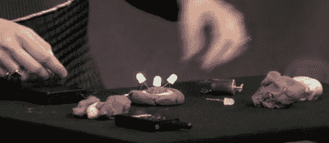

# 微小修补者的湿软电路

> 原文：<https://hackaday.com/2011/04/15/squishy-circuits-for-tiny-tinkerers/>

让孩子们在很小的时候就对电子产品感兴趣是个好主意。通过创造性项目和解决问题来培养他们正在发展的头脑，不仅对孩子有益，而且有助于培养下一代工程师和科学家。圣托马斯大学的教授[AnnMarie Thomas]和她的一个学生[Samuel Johnson]一起总结了一个让孩子们在很小的时候就开始摆弄电子产品的成功秘诀。

虽然有些 5 岁的孩子可以很好地使用烙铁，但有些却不行——更小的孩子可能应该远离这些工具。这就是来自圣托马斯的团队的切入点。

他们在互联网上搜寻橡皮泥配方克隆，在选定两种配方之前，测试每种配方的耐受性和实用性。第一种配方加入了盐，具有非常低的电阻。第二种配方含有糖，其抵抗力是第一种配方的 150 倍。如果你一起使用它们，你有非常简单的导体和绝缘体衬底，可以用小手安全地操作。

正如在下面的演示视频中看到的，一个小电池组可以连接到导电油灰上，轻松点亮 led，转动小马达等。我们只能想象当孩子们第一次给他们的油灰电路通电时，他们脸上会浮现出的愉快的微笑。

虽然到目前为止只制作了两种不同类型的油灰，但我们很有兴趣看看还有什么其他材料可以整合在一起—[自制的 peizo 水晶](http://hackaday.com/2011/03/15/cooking-up-piezo-crystals-at-home/)怎么样？

[谢谢，斯宾塞]

[https://embed.ted.com/talks/annmarie_thomas_squishy_circuits](https://embed.ted.com/talks/annmarie_thomas_squishy_circuits)