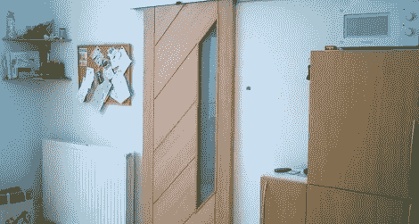

# 不需要舞台工作人员的星际旅行风格的气动门

> 原文：<https://hackaday.com/2011/11/27/star-trek-style-pneumatic-doors-that-dont-require-a-stagehand/>

1966 年，[吉恩·罗登伯里]在《星际迷航》中推出了由舞台工作人员驱动的全手动门。门的声音 *fwoosh* 后来被配音进了每一部电视剧，但是进步在继续，现在【亚历克斯】为他的房子创造了他自己的[星际迷航风格的自动门](http://alexshakespeare.com/)。

该建筑包括一个“控制面板”，[亚历克斯]的门在三种模式下运行:打开，保持打开；关闭，并保持关闭；和自动的。控制面板本身就相当了不起。一个小的[圆盘](http://hackaday.com/wp-content/uploads/2011/11/puck.jpg)与【亚历克斯】柜台下的磁力计互动。如果冰球指向“打开”，则门保持打开。如果门指向“关闭”，门将保持关闭。如果冰球不在磁力计附近，门会在几个红外传感器的帮助下以自动模式运行，以检测有人试图进出[亚历克斯]的厨房。

对于建造的机械部分，[Alex]使用了一个一米长的活塞和他能找到的最安静的空气压缩机[。我们无法从休息后的视频中判断压缩机是否会启动，但[Alex]说它的体积和他的冰箱差不多。作为一个小小的额外收获，新的自动门确实有 *fwoosh* 的声音，就像【基因】想要的那样。](http://www.aircompressorshop.co.uk/product.php?id_product=8)

[https://www.youtube.com/embed/otYAm6OXnH8?version=3&rel=1&showsearch=0&showinfo=1&iv_load_policy=1&fs=1&hl=en-US&autohide=2&wmode=transparent](https://www.youtube.com/embed/otYAm6OXnH8?version=3&rel=1&showsearch=0&showinfo=1&iv_load_policy=1&fs=1&hl=en-US&autohide=2&wmode=transparent)