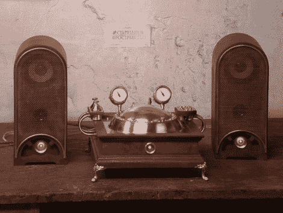

# 蒸汽朋克 CD 播放器

> 原文：<https://hackaday.com/2011/02/05/steampunk-cd-player/>

这个定制的 CD 播放器外壳可能不是你的风格，但你不能否认[的制造技术是一流的](http://steampunker.ru/blog/our_workshop/3130.html) ( [翻译](http://translate.google.com/translate?js=n&prev=_t&hl=en&ie=UTF-8&layout=2&eotf=1&sl=auto&tl=en&u=http://steampunker.ru/blog/our_workshop/3130.html))。首先是一个便携式 CD 播放器和一套扩音扬声器。一个黄铜板作为电子元件的底座，CD 播放器的内部元件从下面安装。覆盖旋转磁盘的黄铜圆顶也是从一片金属开始的，[做了相当多的工作](http://steampunker.ru/blog/our_workshop/3154.html) ( [翻译为](http://translate.google.com/translate?hl=en&sl=auto&tl=en&u=http://steampunker.ru/blog/our_workshop/3154.html))来塑造和平滑这些结果。底座和音箱展示了一些精细的木工工艺，甚至还有额外的灯、控制按钮和驱动两个模拟仪表的电子设备。这个建筑的每个部分都经过了大量的思考，这就是你如何组合出一个杰作的。

[谢谢 Polossatik]