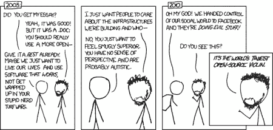

# 没有 Img Alt 标签的 Xkcd 漫画中的隐写术

> 原文：<https://hackaday.com/2012/03/10/steganography-in-xkcd-comics-without-the-img-alt-tag/>

受到最近一篇黑客日志的启发，奥斯汀决定尝试一下隐写术。从古希腊奴隶/信使剃光头、在头皮上纹身，到[再生头发](http://www.machinae.com/crypto/steganography.html)，隐写术或“隐藏文字”已经走过了漫长的道路。我们最近看到一个伪装成小猫的[图片的音乐文件，但是这种隐藏数据的方法需要运行一个 Ruby 脚本。[austin]认为隐写术是磨练他的 JavaScript 技能的好方法，所以他纯粹用 JS 和 HTML 制作了一个图像编码器和解码器。](http://hackaday.com/2012/02/27/this-image-contains-a-hidden-audio-track/)

像以前的化身一样，[奥斯汀]的工作需要一个定期。PNG 图像文件，并隐藏像素数据中的东西。每个像素的一些低位被修改(三位来自红色和蓝色，两位来自绿色——这是一个很好的选择，人眼对绿色非常敏感),并且一个文件被嵌入。PNG 图像。

例如，[奥斯汀]在这篇文章标题下的 xkcd 漫画中嵌入了一些东西。即使图像大部分是白色的，我们也看不出颜色有什么问题。如果你想解码信息，[奥斯汀]把他的编码器和解码器[放到 github](https://github.com/tuseroni/stegano.js)上。请随意尝试一下。