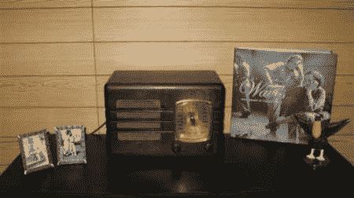

# 一步一步修复和升级古董收音机

> 原文：<https://hackaday.com/2010/11/06/step-by-step-antique-radio-repair-and-upgrade/>

【m3 talhead】带我们了解一台[老式电子管收音机](http://www.instructables.com/id/Vintage-Tube-Radio-Restoration-MP3-Upgrade/)的修理过程。在这种情况下，他的收音机是从 30 年代后期。他能够从[Radiomuseum.org](http://radiomuseum.org/)找到原始数据。他费力地拆除了无线电组件和机柜。他没有完全更新内部结构，而是替换了坏的部分，并使其恢复功能。他想升级 mp3，但他没有直接连接到收音机，而是为他的 MP3 播放器安装了一个调幅发射机。