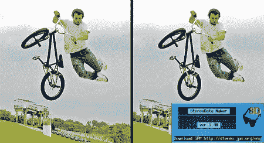

# 立体数据生成器

> 原文：<https://hackaday.com/2008/07/07/stereodata-maker/>

所以你让 CHDK [在你的相机上工作](http://www.hackaday.com/2008/05/27/how-to-expand-your-camera-with-chdk/)，直方图、原始图像文件、可变快门速度和其他附加功能令人惊叹，但立体成像才是你真正想要的。如果你有两台或更多 CHDK 相机，运行[立体数据制作软件](http://stereo.jpn.org/eng/sdm/index.htm)既便宜又容易，这是一个同步多台相机快门和闪光灯的系统。

让 SDM 工作的第一步是在你的 SD 卡上安装软件。你需要为你的相机找到正确的版本；在 SDM 主页上有一个列表。如果您运行的是 Windows XP 或 Vista，请运行 zip 文件中的安装程序。否则，将文件加载到 SD 卡上，并直接从相机运行安装程序。然后决定这是右边还是左边的摄像机，并为你的第二个摄像机重复这些步骤。

接下来，你需要准备一个开关单元，基本上是一组同步的 USB 遥控器。有许多现成的商业单元可用，但是自己建造一个应该不会有太大的麻烦，SDM 的说明页面上提供了一些想法。

您基本上已经准备好开始拍摄立体图像，只需进行一些测试拍摄来适应它，并定制相机上的配置。

*   [永久链接](http://stereo.jpn.org/eng/sdm/index.htm)