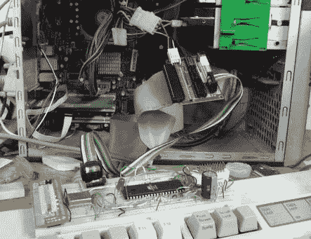

# STK200 袖珍变化编程器

> 原文：<https://hackaday.com/2011/02/03/stk200-pocket-change-programmer/>

初学者对微控制器编程的一个常见抱怨是 [DIY 工具的可用性，](http://hackaday.com/2010/10/25/avr-programming-02-the-hardware/#more-29425)不需要并行端口。使用不超过几个 74xx 系列芯片和一些原型板，[Rue]能够以低于它可以编程的一些芯片的成本创建[一个 AVR 编程器](http://eds.dyndns.org/~ircjunk/tutorials/elex/ata2isp/main.html)——给并行编程器一个机会。【Rue】用过的 [Linux](http://hackaday.com/category/linux-hacks/) 把无处不在的 PATA/IDE 端口当成并口。通过让 [avrdude](http://www.bsdhome.com/avrdude/) 将程序员视为[Atmel STK 200](http://www.atmel.com/dyn/resources/prod_documents/doc1107.pdf),【Rue】能够通过 ISP 将 blinky 程序上传到他的 AVR 微控制器。如果有人能想到一个更低成本的非常规解决方案，给我们喊一声。