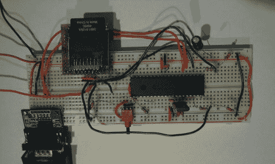

# 满足您黑客需求的存储空间

> 原文：<https://hackaday.com/2010/03/14/storage-for-your-hacking-needs/>

有时你的项目需要大量的非易失性 ROM，恰到好处[Matthew]让我们不仅知道如何通过串行接口用 PIC 连接、连接、读取和写入 SD 卡，还知道如何用旧的 PATA 硬盘[做上面提到的事情。对于那些没有 PIC/串行连接的人不要担心，[nada]让我们知道他的](http://justanotherlanguage.org/content/jallib/tutorials/tutorial_pata_hard_disk)[总线盗版 SD 卡黑客](http://nada-labs.net/2010/using-the-buspirate-with-a-sd-card/)，其中我们个人最喜欢的部分是创造性地使用一个旧的 5.25”软盘连接器作为 SD 卡插座。