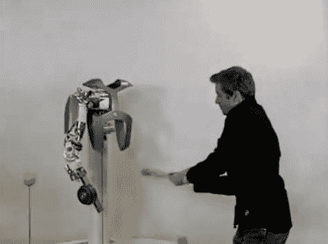

# 压力测试机器人…带着棒球棒

> 原文：<https://hackaday.com/2011/05/13/stress-testing-robots-with-baseball-bats/>

当你正在建造第一个 Cyberdyne Systems Model 101 原型时，你必须以某种方式测试它，对吗？

你可能会认出下面视频中被虐待的机器人，因为在之前[我们已经讨论过一次它的手的构造。德国航空航天中心已经在 DLR 手臂系统上工作了一段时间，并且显然非常兴奋地向您展示他们的设计如何执行。](http://hackaday.com/2011/01/26/robot-hand-has-no-problem-giving-you-the-finger/)

如果你不熟悉，你在那里看到的手臂使用 52 个不同的电机，小型化的控制电子设备和一系列合成肌腱，表现得像人类的手臂——只是更好。该系统的关节不仅提供了令人难以置信的关节，它们是专门设计的，允许该单位吸收和耗散大量的能量，而不损坏结构。

我们认为，任何人都很难保持镇静，更不用说在遭受棒球棍打击后能够移动手臂，然而机器人手臂却表现得很好。这确实是令人敬畏的技术。

[https://www.youtube.com/embed/2JT9rD5VGvQ?version=3&rel=1&showsearch=0&showinfo=1&iv_load_policy=1&fs=1&hl=en-US&autohide=2&wmode=transparent](https://www.youtube.com/embed/2JT9rD5VGvQ?version=3&rel=1&showsearch=0&showinfo=1&iv_load_policy=1&fs=1&hl=en-US&autohide=2&wmode=transparent)