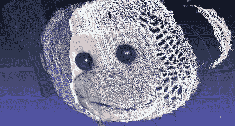

# 结构光三维扫描仪

> 原文：<https://hackaday.com/2011/10/08/structured-light-3d-scanner/>

在摆弄了一个廉价的微型投影仪、一个网络摄像头和一点软件之后，[Jas Strong]为自己建造了一个 3d 扫描仪。

尽管有几十个基于 Kinect 的扫描仪项目，我们以前也见过 T2 结构光 3d 扫描仪。这种体积扫描方法将一系列梯度图像投射到对象上。相机捕捉模型上明暗图案的图像，进行数学运算，3d 数据从计算机中输出。

【Jas】在 Woot 上发现了一个[微视 SHOWWX](http://www.microvision.com/showwx/overview.html) 激光微型投影仪。投影仪中的激光对她的 3d 模型的质量起着很大的作用——在没有焦点的情况下，[Jas]可以近距离获得非常准确的深度信息。罗技网络摄像头经过改进，可以更紧密地聚焦，处理视频捕捉任务。软件方面的东西是一些[这些结构光](http://code.google.com/p/structured-light/downloads/list)实用程序，融合成一个单一的处理草图。

对于使用木工夹具将所有东西固定在一起的[钻机](http://hackaday.com/wp-content/uploads/2011/10/rig.jpg)来说，这个结果非常显著。【雅】’[她的猫家的 3d 模型](http://hackaday.com/wp-content/uploads/2011/10/spottycat.png)看起来很不错。她在系统中还有一些问题需要解决，但是[Jas] ~~计划很快将她的成果发布到野外。每当发生这种情况，我们都会更新这篇文章。~~使她的代码可用[这里](http://www.electronpusher.org/~jasmine/ThreePhaseCapture.zip)。代码需要 [ControlP5](http://www.sojamo.de/libraries/controlP5/) 和 [PeasyCam](http://mrfeinberg.com/peasycam/) 库。