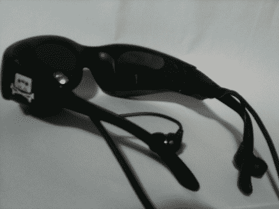

# 笔 HMD

> 原文：<https://hackaday.com/2010/07/08/stylin-hmd/>

注意了，[这些太阳镜](http://www.teamhackaday.com/forum/viewtopic.php?f=11&t=3379)实际上是一个[头盔显示器](http://hackaday.com/2010/02/15/hmd-upgrade/)。[Staffan]说他从 1995 年就想要数据眼镜，但目前的产品让用户看起来很可笑，我们[不得不同意](http://hackaday.com/2008/06/07/consumer-hmd-comparison/)。虽然他的论坛帖子有点缺乏细节，但他承诺很快会给我们更多信息。现在，至少让我们知道分辨率，大概是:480×1280 或 480x427x3，[你可以自己判断](http://www.stereo3d.com/hmd.htm#resolution)。更新:【Staffan】已澄清“分辨率为 480*1280 真像素。这是通过将屏幕跨越两个 Kopin CyberDisplay VGA 模块来实现的。”

无论如何，[Staffan]正在寻求帮助来完善眼镜，具体是什么我们还不确定，但这个项目看起来很有希望，我们希望他继续努力。