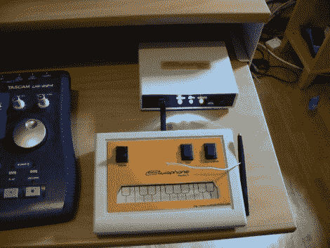

# stylophone 5–将 1968 年的最佳硬件进行现代化

> 原文：<https://hackaday.com/2011/11/15/stylophone-5-modernizing-the-best-of-the-1968-hardware/>

我们喜欢参与(西蒙·因斯的)项目，这一定是他最好的作品之一。这是他的支持 MIDI 的唱机的第五个版本。该控制系统的要点是通过与有线唱针的尖端连接来演奏导电键盘(由镀锡 PCB 制成)——因此得名。这个想法来自最初的 1968 年 Dubreq Stylophone 硬件，但[西蒙的]不只是使用这个想法。他有自己的工作原件，并用它来逆向工程电路设计。

当它第一次出现时，Stylophone 有三种低音、标准和高音音频范围。它们的区别仅在于电路中使用的无源元件的选择。[Simon]在他的设计中加入了变化，这样它们就可以在一个单元上被选择。这个最新版本通过 USB 连接，允许您控制 MIDI 软件。但与他的前四次迭代不同，这也提供了 MIDI-In 功能。这使得从计算机界面控制调音、颤音和驱动唱针电路成为可能。休息之后，请观看视频片段，好好看看，这是一个怀旧的门户时刻。

如果你正在寻找一个更简单的构建，你可以试试这个模拟独立版本的 Stylophone。

[https://www.youtube.com/embed/BMTsH8w74PY?version=3&rel=1&showsearch=0&showinfo=1&iv_load_policy=1&fs=1&hl=en-US&autohide=2&wmode=transparent](https://www.youtube.com/embed/BMTsH8w74PY?version=3&rel=1&showsearch=0&showinfo=1&iv_load_policy=1&fs=1&hl=en-US&autohide=2&wmode=transparent)