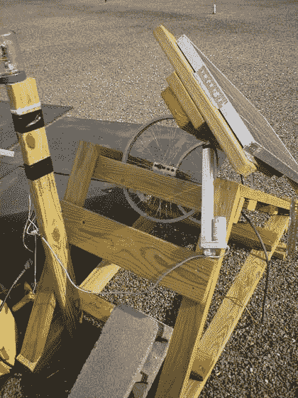

# 太阳跟踪太阳能电池板

> 原文：<https://hackaday.com/2010/05/24/sun-tracking-solar-panel/>

众所周知，太阳能电池板必须暴露在尽可能多的阳光下才能达到最高效率。坚固的安装限制了面板完全暴露在阳光直射下的时间。解决方案是[建造一个旋转支架，自动瞄准太阳](http://www.instructables.com/id/Solar-PV-tracker/)。

[bwitmer]带我们了解用木头和旧自行车轮圈建造一个的过程。他买了一个[预制跟踪单元](http://www.redrok.com/led3xassm.htm#led3xforsale)来控制他的致动器，但是我们认为[在座的很多人](http://hackaday.com/2008/12/06/track-the-sun-for-home-lighting/)可以[自己动手装配](http://hackaday.com/2009/10/01/solar-tracking-without-overkill/)。

[via [HacknMod](http://hacknmod.com/hack/diy-sun-tracking-solar-panels/)