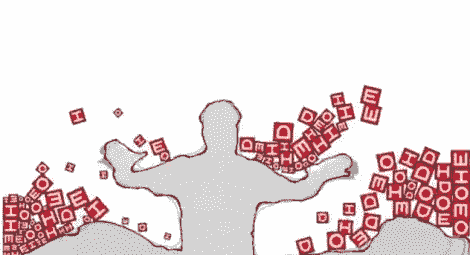

# 超精细 Kinect 物理演示

> 原文：<https://hackaday.com/2011/04/13/super-refined-kinect-physics-demo/>

由于 Kinect 在黑客中如此受欢迎，IDEO 实验室的[Brad Simpson]最终为他们的办公室购买了一台，并立即着手进行修补。在大约 2-3 个小时的时间里，[他完成了一个非常酷的物理演示](http://labs.ideo.com/2011/04/12/kinect-interactivity-demo/)，展示了 Kinect 的一些功能。

他没有像我们见过的大多数黑客那样使用粗略的框架测量，而是非常关注软件方面的事情。开始使用 Kinect 的全分辨率([不是每个人都这样做的](http://hackaday.com/2011/02/28/encase-yourself-in-carbonite-with-kinect/))【Brad】在创建下面嵌入的视频之前，对数据进行了一些处理。骨架数据被收集并通过平滑算法的多次迭代运行，以显著降低最终轮廓周围的噪声。

最终产品与我们习惯看到的 Kinect 视频有很大不同，它极大地改善了用户与添加到环境中的虚拟对象的交互方式。正如你可能已经注意到的，添加到视频中的块~~从来没有~~很少穿透电影中个人的轮廓。这并不是因为某种数字欺骗——[ Brad]能够通过调整 Kinect 数据馈送来防止不同对象的交叉。

我们不确定整个设置需要多少计算能力，但代码可以从他们的 Google 代码库中获得，所以我们希望看到其他项目通过利用这里展示的技术进行改进。

[通过 [KinectHacks](http://www.kinect-hacks.com/kinect-hacks/2011/04/11/kinect-physics-demo)

【维梅奥 http://vimeo.com/22219563 w = 470】