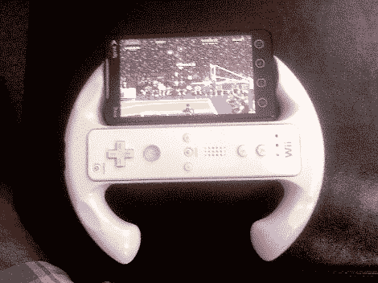

# 适用于 Android 或 IPhone 的超级简单游戏控制器

> 原文：<https://hackaday.com/2010/07/29/super-simple-gaming-controller-for-android-or-iphone/>

如果你有一台 iPhone 或 Android 设备，在玩游戏时使用 Wii 遥控器，这种快速的黑客技术将为你提供管理所有硬件所需的第三只手。把他的安卓手机安装到 Wii wheel 上，只需要几美元的零件。他在一元店碰到了轮子本身，手机是用一个通用安装支架固定的。一个小的方形垫可以粘在任何设备的背面，并与底座相匹配。他把底座不必要的部分切掉，粘在轮子背面。

如果你还没有尝试过在手机上使用 Wii 遥控器，那就看看如何在 iPhone 上使用或者在安卓系统上使用的[吧。](http://hackaday.com/2010/05/13/wii-remote-connectivity-for-android-devices/)