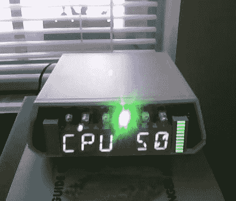

# 超级 VMW CPU 计量器

> 原文：<https://hackaday.com/2011/04/07/super-vmw-cpu-meter/>

经过多次延迟、重启和数年之后，[文斯]终于完成了他的超级 VMW CPU 计量器。配备六个字母数字红色 led 显示屏、两个 10 段条形图、十二个红色 led 和六个彩色 led，有足够的“屏幕”空间来显示各种有用的信息。

它由连接到 i2c 总线的四个 SAA1064 LED 驱动芯片驱动，I2C 总线由 PC 的并行端口连接，并由 linux 中的软件驱动。该软件允许您为您想要的任何应用程序构建显示器，甚至包括一个彩色 ASCII 输出，这样您甚至可以在拥有硬件之前就可以看到它的外观。

给出了四个例子，一个是 cpu 计量器，它使用条形图显示每个内核的负载。另一种是在显示歌曲信息时，将条形图用作音乐的 VU 表。有一个所有正常格式的时钟+ UNIX 时间，和一些滚动文本演示。

施工变得有点奇怪，因为芯片和连接器的突出部分没有真正考虑在内，所以需要一些“放样”来提高电路板其余部分的故障点。这不是我们想要做的事情，但如果我们面临这种情况，这是一个方便的技巧。

休息后加入我们，观看这场疯狂的灯光秀。[https://www.youtube.com/embed/Rxlrvzy30pg?version=3&rel=1&showsearch=0&showinfo=1&iv_load_policy=1&fs=1&hl=en-US&autohide=2&wmode=transparent](https://www.youtube.com/embed/Rxlrvzy30pg?version=3&rel=1&showsearch=0&showinfo=1&iv_load_policy=1&fs=1&hl=en-US&autohide=2&wmode=transparent)