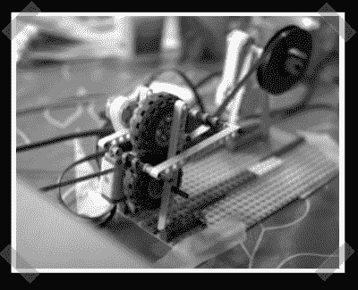

# Super8 自动胶片扫描仪

> 原文：<https://hackaday.com/2007/12/08/super8-automatic-film-scanner/>

【edocronian】派[这个](http://www.kaimio.fi/blogs/harri/entry/fun_with_mindstorms_old_8mm)有趣的头脑风暴黑客。[哈里]有几个 Super8 卷轴，他在 80 年代拍摄的。他的孩子们组装了这个 mindstorm NXT 传输机制，他用 linux 完成了剩下的工作。乐高将卷轴拉过爱普生扫描仪，一些 linux 黑客运行扫描仪，识别帧，并重建电影。不幸的是，[哈里]没有发布任何他用来实现这一目标的软件。

*   [永久链接](http://www.kaimio.fi/blogs/harri/entry/fun_with_mindstorms_old_8mm)