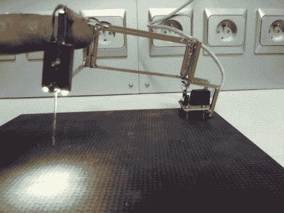

# 表面贴装助焊剂

> 原文：<https://hackaday.com/2011/10/14/surface-mount-solder-assitant/>

通过使用[这种表面贴装助焊剂](http://schematheek.net/index.php?p=forum/topic&t=650&n=1) ( [翻译](http://translate.google.com/translate?sl=auto&tl=en&js=n&prev=_t&hl=en&ie=UTF-8&layout=2&eotf=1&u=http%3A%2F%2Fschematheek.net%2Findex.php%3Fp%3Dforum%2Ftopic%26t%3D650%26n%3D1))，确保那些微小的零件知道它们的位置。它就像一个小包装的夹子；重力和一根针把它们固定住，同时你做一些手工焊接。[红魔鬼]通过将一些黄铜轨道焊接到一个带夹子的铰链框架中来接受针尖，从而开始建造。接下来，添加了一对灯管来接受照亮工作区的 led(我们认为这是一种奇妙的触摸)。最后，组件被安装到构成工作表面的方形底座的角落。

这基本上是一个简单的重力钳的复杂版本[。但是，如果你做一些装配线焊接，这将是不可或缺的。对于这种工作，](http://hackaday.com/2010/12/13/diy-clamp-helps-with-surface-mount-soldering/)[定制夹具往往是建立](http://hackaday.com/2011/08/21/one-man-smd-assembly-line-shares-a-lot-of-tips-about-doing-it-right/)。这种情况仍然存在，但这种电枢消除了在每个夹具中构建一些东西来固定 SMD 元件的需要。