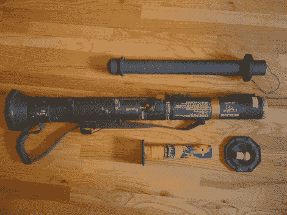

# 剩余的火箭筒被改装成发射烟火炮弹

> 原文：<https://hackaday.com/2011/07/15/surplus-bazooka-converted-to-shoot-firework-artillery-shells/>

[马克]和他的朋友喜欢烟火，但厌倦了传统的地面发射迫击炮弹，所以他们决定增加一点趣味。

不久前，他在一次枪展上购买了一个军用火箭筒，但没怎么用过，所以它闲置了大约 10 年。他把它从仓库里挖了出来，然后去当地的五金店买了一些 PVC 管。他将管子切割成合适的尺寸，然后用他的 3D 打印机制造了几个零件，将 PVC 管安全地安装到火箭筒的外壳上。用他的标准管，他可以从火箭筒发射 2 英寸迫击炮，但他说他可以增加第二个 PVC 嵌套长度，以允许更小的子弹。

显然，如果这种装置被误认为是真正的武器，或者如果你的烟花是从高速公路休息站的某个家伙的后备箱里买的，那么这种装置是相当危险的。[马克]和他的朋友在使用发射器时已经采取了一些预防措施，但这显然仍然是一个有风险的企业。

也就是说，我们认为它很棒，如果有人有备用火箭筒，请随时发给我们！

继续阅读，看看火箭筒烟花发射器的行动。

不是火箭筒，是 AT-4。感谢指出来的人。

[https://www.youtube.com/embed/TUdNGFR3cIw?version=3&rel=1&showsearch=0&showinfo=1&iv_load_policy=1&fs=1&hl=en-US&autohide=2&wmode=transparent](https://www.youtube.com/embed/TUdNGFR3cIw?version=3&rel=1&showsearch=0&showinfo=1&iv_load_policy=1&fs=1&hl=en-US&autohide=2&wmode=transparent)