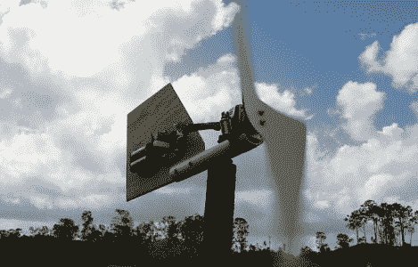

# 可持续发展黑客:风力涡轮机电池充电器

> 原文：<https://hackaday.com/2011/09/27/sustainability-hack-wind-turbine-battery-charger/>

打开你的零件箱，留出一个下午的时间来建造一个能给电池充电的风力涡轮机。你可以看到两个 AA 电池挂在这个小发电机的旁边。你只需要几个零件就能做到这一点，而且很可能你已经把它们扔进垃圾箱了。

发电机本身是一个小型步进电机，可以从软盘驱动器或扫描仪中取出。叶片由一根 3.5 英寸(90 毫米)的 PVC 管切割而成，另一根直径更小的管子作为涡轮机的主体。尾鳍确保它总是指向风，由一些胶合板制成。随着刀片旋转，步进电机的控制引脚上感应出电流。通过构建一对桥式整流器并使用 RC 滤波器，您将最大限度地利用产生的电流。

这种涡轮机可以在大约 10 小时内为一对镍镉电池充电，但开发一些智能电路来管理充电可能是值得的。如果它能够在专用蓄电池和车载电池座之间进行选择，你就可以充分利用所有的风能。

[谢谢迈克尔]