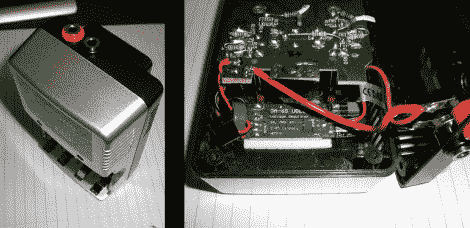

# 可持续发展秘诀:太阳能电池/智能手机充电器

> 原文：<https://hackaday.com/2011/09/28/sustainability-hacks-solar-batterysmartphone-charger/>

[迈克尔]拿了一个本应连接到主电源的电池充电器，并将其转换成太阳能电池板。这是一个传统的 4 芯充电器，成对充电。他保留了这一功能，但增加了带有特殊过流功能的 USB 充电。那是因为他的安卓手机有快有慢的 USB 充电模式。慢速模式确保其功耗小于或等于 500 mA，符合 USB 规格。但是，当手机检测到 USB 连接连接到墙上充电器时，快速模式会消耗更多的电流。[Michael]添加了一个开关，它给数据线贴上一个上拉电阻，向手机发出信号，可以切换到快速充电模式。

至于电源本身，你可以看到[迈克尔]折断了电路板上原来的调节器。他添加了自己的 5V 开关稳压器，提供了广泛的输入电压范围。这是连接到两个香蕉插头插座，可以连接到太阳能电池板。