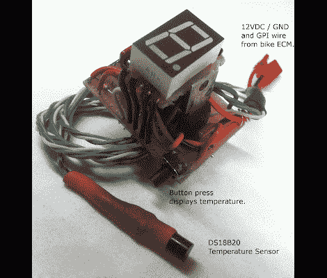

# 铃木 V-Strom 当前档位指示器

> 原文：<https://hackaday.com/2012/02/09/suzuki-v-strom-current-gear-indicator/>

[钢铁丛林]刚刚完成[为他的摩托车](http://ijprojects.blogspot.com/2012/01/suzuki-v-strom-dl1000-gear-position.html)制造这个档位指示器。它使用一个红色的 7 段显示器向骑手显示什么齿轮目前正在进行。这种黑客行为很常见，让我们想知道为什么所有的摩托车都没有这个功能？但是话说回来，如果他们这么做了，你也没有理由去黑他们。

摩托车确实有档位传感器；显然，它只是缺少显示这些数据的方法。该传感器输出 0 到 5V 之间的信号，[Iron Jungle]使用 PICAXE 18M2 微控制器读取该信号。接入那个信号一点也不难。一旦他找到了正确的导线，他只需去掉一部分绝缘层，然后将一根导线焊接到导体上。这应该能够承受像这样的汽车应用中遇到的振动。由于计算能力已经存在，他还包括一个 DS18B20 来读取环境空气温度。休息后请观看快速演示。

这不是我们第一次看到 V-Storm 有一个定制的档位指示器。但是如果你真的想全力以赴，也许你需要[为你的平板电脑或智能手机](http://hackaday.com/2011/09/19/attiny-hacks-reading-from-a-motorcycles-j1850-data-bus/)建立一个接口。 [https://www.youtube.com/embed/9fCAQ5-_C24?version=3&rel=1&showsearch=0&showinfo=1&iv_load_policy=1&fs=1&hl=en-US&autohide=2&wmode=transparent](https://www.youtube.com/embed/9fCAQ5-_C24?version=3&rel=1&showsearch=0&showinfo=1&iv_load_policy=1&fs=1&hl=en-US&autohide=2&wmode=transparent)