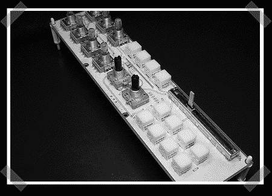

# 同步大师，自制的模块化 Midi 控制器。

> 原文：<https://hackaday.com/2008/08/22/syncmaster-home-made-modular-midi-controller/>

【D . St-Amand】正在从头开始设计 [SyncMaster](http://www.flickr.com/photos/x-mob/) ，一款紧凑型模块化 midi 控制器。该设计侧重于模块化构建，您可以像上面的图片一样交换部件，以实现不同的布局。它不仅是模块化的，而且非常紧凑。显示在一些常见的竞争对手旁边，看起来非常圆滑。

发展似乎在前进，图片更新频繁。让我们希望不久能看到一个全功能的演示。关于构建的一些更详细的信息也是不错的。这可能会让你想起我们在 [MachineCollective](http://www.hackaday.com/2008/07/09/custom-modular-control-interfaces/) 上的故事。虽然它们在模块化方面有相似之处，但 SyncMaster 似乎是一款更加精致和可移植的产品。随时向我们报告最新情况。

*   [永久链接](http://www.flickr.com/photos/x-mob/)