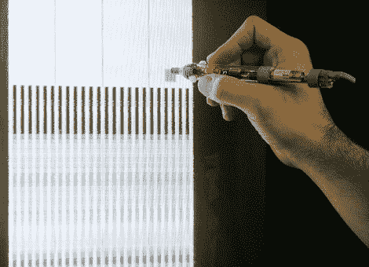

# 用光敏笔和 CRT 电视合成声音

> 原文：<https://hackaday.com/2011/10/29/synthesizing-sound-with-a-light-sensitive-pen-and-crt-television/>

这是[尼克拉斯·罗伊工作室]的最新项目。Lumenoise 是一种[音频合成器，通过在 CRT 电视上用光敏笔](http://www.niklasroy.com/project/116/Lumenoise)绘图来控制。

该笔是一个独立模块，通过音频和复合视频 RCA 插头连接到电视。在透明的笔壳内，你会发现一个产生音频和视频的微控制器。笔的商业端包含一个光电晶体管，让 ATmega8 从视频屏幕上读取数据。由于芯片正在产生视频信号，因此可以计算笔尖在屏幕上的位置，并根据该数据调制声音输出。休息之后，你可以在视频中观看比赛结果的录像。

这是一个非常简单的电路，而且[Niklas]指出，我们大多数人都在某个黑暗的角落里挂着一个 CRT。我们认为这将是一个与孩子们一起做的奇妙的焊接项目，而且这将是一件适合在家里作为儿童博物馆的作品，因为在玩它时会有令人惊叹的因素。

从这件事和他过去的一些项目中我们可以看出，[Niklas]非常喜欢 8 位音频。

[https://www.youtube.com/embed/lfrOrR6T9FM?version=3&rel=1&showsearch=0&showinfo=1&iv_load_policy=1&fs=1&hl=en-US&autohide=2&wmode=transparent](https://www.youtube.com/embed/lfrOrR6T9FM?version=3&rel=1&showsearch=0&showinfo=1&iv_load_policy=1&fs=1&hl=en-US&autohide=2&wmode=transparent)