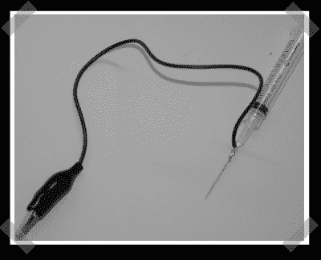

# 注射器逻辑探针

> 原文：<https://hackaday.com/2008/05/15/syringe-logic-probe/>

【特拉维斯】派里他哦这么简单(我怎么没想到)[注射器逻辑探针](http://travisgoodspeed.blogspot.com/2008/05/syringe-logic-probe.html)。这是他为他的[水坑逻辑分析仪](http://www.sump.org/projects/analyzer/)版本组装的。真正的探针往往非常昂贵。通过一些努力，你可以在那里安装一个 led/二极管/电阻，制作一个简单的 5v 逻辑探针。如果你想要一个漂亮的逻辑分析仪，它所基于的 Spartan-3 板仅售 99 美元。

*   [永久链接](http://travisgoodspeed.blogspot.com/2008/05/syringe-logic-probe.html)