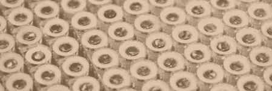

# 具有电磁体的触觉计算机接口

> 原文：<https://hackaday.com/2011/10/25/tactile-computer-interface-with-electromagnets/>

这并不是说触摸屏键盘很可怕，而是几乎不可能在 iPad 或其他平板电脑键盘上触摸打字。亚琛大学媒体计算小组的一个团队想出了如何在显示器下面放置一系列电磁体来为触摸屏提供触觉反馈。他们在 [2011 年尤斯特会议](http://www.acm.org/uist/uist2011/)上展示了他们的技术，并发布了他们的论文。

对于这个团队喜欢称之为“手指流”的东西，一个由小电磁铁组成的床被放在一个平板显示器的下面。用户佩戴一个带有永久磁铁的“顶针”。驱动电磁体床轻微移动磁体，并给用户提供一点点感觉。

FingerFlux 可以像键盘一样用于提供触觉反馈。该系统还可以用于建模约束——确保用户不会移动到他们所操作的控件之外，并可以引导用户找到所需的按钮。

一张电磁铁床将是平板电脑的一个受欢迎的附加物，即使只是为了防止伪路杰。休息后看看手指流的演示。

感谢[John]发送此邮件。

[https://www.youtube.com/embed/trM7mXOjNFY?version=3&rel=1&showsearch=0&showinfo=1&iv_load_policy=1&fs=1&hl=en-US&autohide=2&wmode=transparent](https://www.youtube.com/embed/trM7mXOjNFY?version=3&rel=1&showsearch=0&showinfo=1&iv_load_policy=1&fs=1&hl=en-US&autohide=2&wmode=transparent)