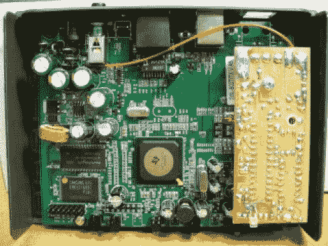

# 路由器中的终端节点控制器

> 原文：<https://hackaday.com/2010/07/23/terminal-node-controller-in-a-router/>

【安德鲁】用[一个 DSL 路由器做了自己的终端节点控制器](http://www.quicktrip.co.nz/jaqblog/home/31-dlinkigatepart2)。这将成为 APRS T2 T3 网络的一部分，这是一个由业余无线电运营商建立的基于互联网的网络。这里使用的路由器是一个 Dlink DSL-502T，带有一个基于 AVR 的 TNC 模块，连接到串行端口头。电话线连接器及其随附的硬件已被移除，以便为 TNC 模块腾出空间，该模块通过红色电线提供 12V 电压。当路由器启动时，它将数据发送到串行端口报头，因此 TNC 上的固件需要一些调整来适应这一点(对开源来说是这样的)。

想要更多的 APRS 美食吗？看看这个 [AVR APRS 跟踪器](http://hackaday.com/2009/05/08/whereavr-aprs-tracker/)。